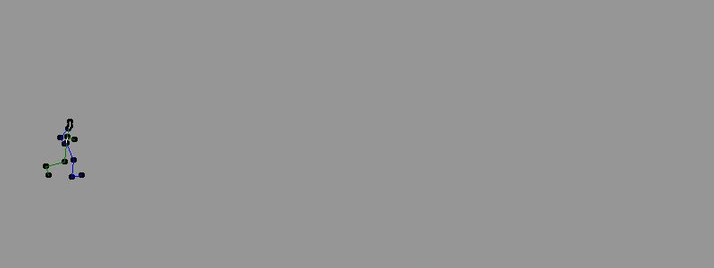

Procedural Locomotion
=====================

Automating human walk cycles using machine learning

Notes
-----

To view the trained locomotion, do:

`cd src`

`python AnimationViewer.py`

Notes on training the model will be added in the future.

This project uses data extracted by the [animation editor project](https://github.com/hmoraldo/AnimationEditor).

