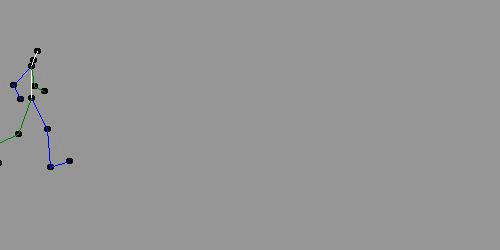
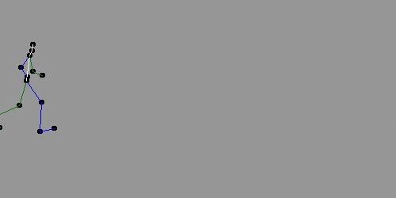
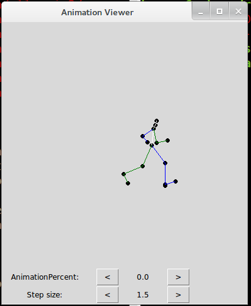

Procedural Locomotion
=====================

Automating human walk cycles using machine learning.

This system allows generatation of continuous walking animations that have a speed (or step distance) parameter. The same procedural animation can be run at different speeds: walking, running, and any other speed in between.

Training
--------

The same training process that is used for locomotion, could also be used for many other purposes, like animal locomotion, and general human movements. Also, this could be easily generalized to 3D.

The way to train the procedural locomotion system is as follows:

* Vertex position is extracted from videos and animations using the [animation editor project](https://github.com/hmoraldo/AnimationEditor). The data used to generate the walking animations in the images above is included in the data/ directory.

* The extracted data is normalized using NormalizeAll.py. This normalization process converts all vertices that were extracted from animations of different subjects into a single normalized dataset. Interpolated data can also be added at this step, which can be useful in some cases (although it wasn't critical really). The result of this step is a dataset with two input variables (step size and frame), and the normaliced vertex coordinates as output variables.

* The model is learnt using Learn.py. This uses linear regression to learn the procedural locomotion model.

* AnimationViewer.py can be used to view the result. As shown in the screenshot below, it allows the user to play a given walking animation (by changing the AnimationPercent parameter) and to change the walking or running speed (Step size parameter). The Visualize.py file also allows for simple visualizations of the input dataset.

* The result model is a model for a single walking step. A walking animation requires many such single steps to be chained together. GifGenerator.py allows for generatation of gifs like the ones on this page. It also shows how the locomotion model can be used for building more complex animations; for example it shows how to change the origin from step to step, and how to blend two steps to make them match exactly.

